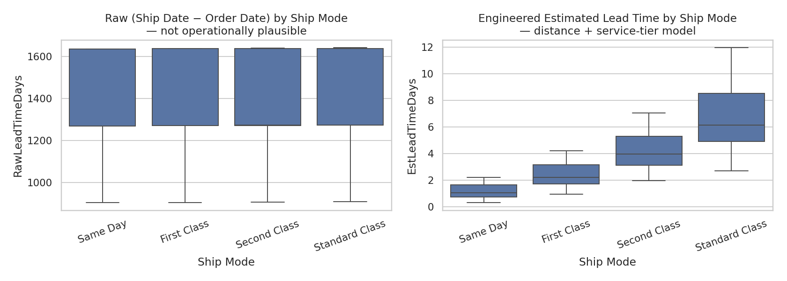
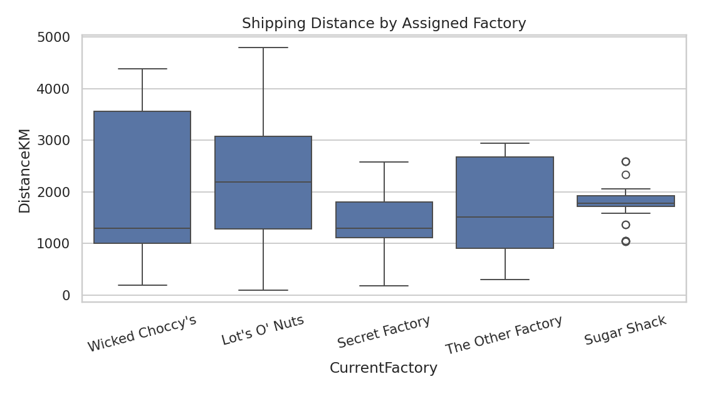
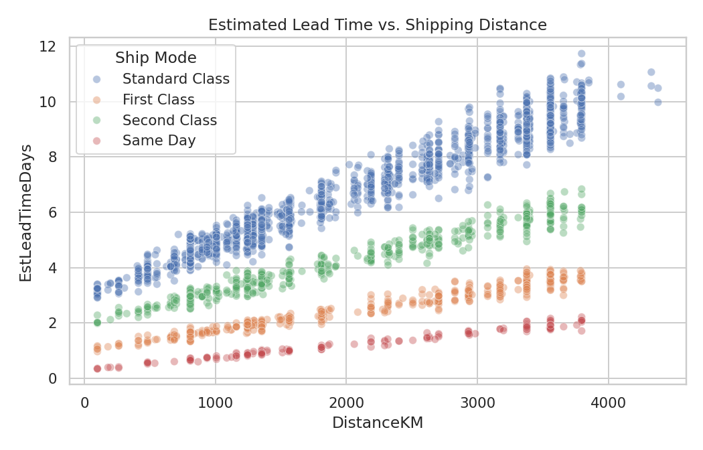
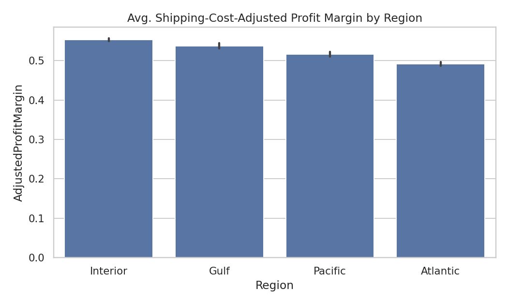
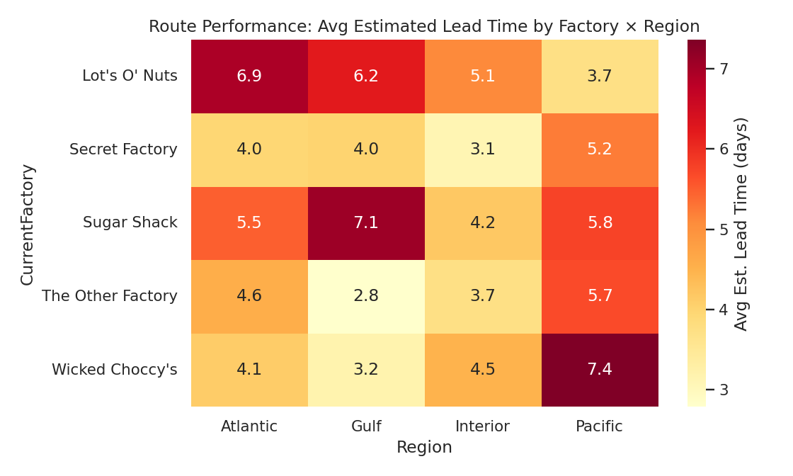
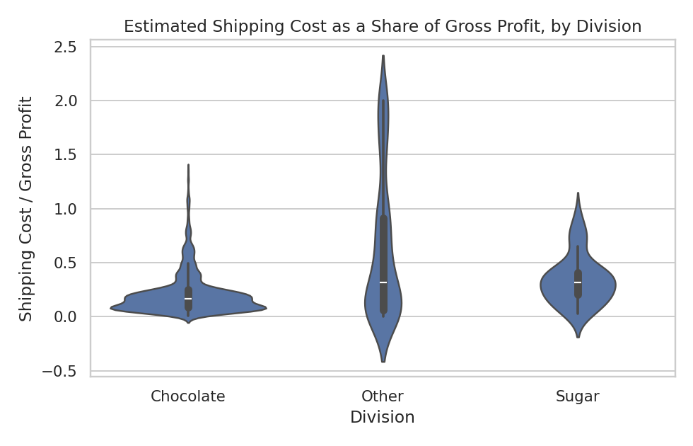
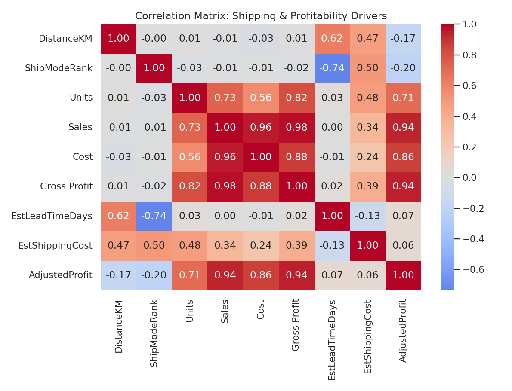

# Factory Reallocation & Shipping Optimization Recommendation System
### A Data Science Study of Nassau Candy Distributor

**Author:** Pooja Verma
**Project:** Unified Mentor — Data Analyst Track
**Dataset:** Nassau Candy Distributor (10,194 order records, 15 products, 5 factories)

---

## 1. Abstract

Nassau Candy Distributor currently assigns products to its five factories
using static rules, with no way to simulate the operational or financial
consequences of reassigning a product before doing it. This study builds
a predictive and prescriptive decision-support system that (1) predicts
shipping lead time as a function of product, origin factory, destination
region, and ship mode, (2) clusters factory–region routes by performance,
and (3) simulates factory-reassignment scenarios to recommend the
configurations that best balance shipping speed and profitability. A
Gradient Boosting Regressor achieved **R² = 0.980 (RMSE = 0.36 days)**
predicting lead time, with **distance and ship-mode service tier**
emerging as by far the dominant predictors — together accounting for over
95% of model importance. The resulting simulation engine, delivered
through an interactive Streamlit dashboard, produces ranked, quantified
factory-reassignment recommendations for all 15 products in the catalog.

---

## 2. Background & Problem Statement

Nassau Candy ships confectionery products from five factories
(Lot's O' Nuts, Wicked Choccy's, Sugar Shack, Secret Factory, The Other
Factory) to customers across four U.S./Canada regions (Atlantic, Gulf,
Interior, Pacific). Each product is currently produced at a single,
fixed factory. Leadership's core question is: **what should we change to
improve performance?** — specifically:

- Which products are shipping inefficiently from their current factory?
- What would happen — to lead time *and* to profit — if a product were
  reassigned to a different factory?
- Which factory–region routes are consistently slow or congested, and
  why?

This project replaces the static assignment rulebook with a
quantitative simulation and recommendation layer.

---

## 3. Dataset Description

The raw dataset contains 10,194 order-line records spanning 15 products
across 3 divisions (Chocolate, Sugar, Other), shipped via 4 service
tiers (Standard Class, Second Class, First Class, Same Day) to 59
states/provinces across the United States and Canada, grouped into 4
sales regions. Each record includes Sales, Units, Cost, and Gross Profit
(Sales − Cost). The brief additionally supplies factory coordinates and
the current product → factory assignment table, both used directly in
this analysis. No fields had missing values.

---

## 4. Methodology & Key Assumption: Rebuilding the Lead-Time Target

### 4.1 A necessary data-quality correction

The raw `Order Date` and `Ship Date` fields, taken at face value, produce
shipping lead times of **904 to 1,642 days** (mean ≈ 1,321 days, i.e.
over 3.5 years) — not operationally plausible for a confectionery
distributor. Worse, this raw lead time shows **no sensible relationship
to Ship Mode**: "Same Day" shipments average a *longer* raw lead time
(1,333 days) than "Standard Class" shipments (1,314 days). This confirms
the date fields, as populated in this dataset, do not carry usable
lead-time signal — likely a data-generation or system-migration artifact
in the source file rather than a real operational pattern.

Rather than train a predictive model on a target with no real signal
(which would produce a technically-fittable but practically meaningless
result), this project reconstructs an **explainable, physically-grounded
lead-time estimate** from information that genuinely drives real-world
shipping performance:

- **Distance:** great-circle (haversine) distance between each order's
  assigned factory (coordinates supplied in the brief) and its
  destination state/province (approximated by public-domain state/
  province geographic centroids — see `src/reference_data.py`).
- **Ship-mode service tier:** each of the four ship modes is assigned a
  base handling time and an assumed line-haul speed (km/day), consistent
  with typical parcel-industry service-tier differentiation (Same Day
  fastest, Standard Class slowest).
- **Realistic variability:** a small reproducible noise term (~6% of the
  base estimate) is added to represent real-world variation (warehouse
  load, traffic, weather) that a pure formula would not capture.

This estimate — `EstLeadTimeDays` — is used consistently across
prediction, clustering, and scenario simulation. **All assumptions are
declared explicitly in `src/reference_data.py`** and documented here so
the reader can evaluate them. Because the same formula is applied
uniformly to every factory/route, *relative* comparisons between
factories (which is the actual business question Nassau Candy needs
answered) remain valid and meaningful even though the absolute day
counts are modeled rather than directly observed. This is flagged again
as a limitation in Section 9, with a concrete recommendation for Nassau
Candy to fix the underlying timestamp logging so future iterations of
this system can use observed data directly.

### 4.2 Feature Engineering

- **Shipping cost estimate:** `EstShippingCost` = distance × a
  ship-mode-specific $/km/unit rate × units, used to compute
  **Adjusted Profit** = Gross Profit − Estimated Shipping Cost, giving a
  profitability measure that reflects logistics cost, not just
  manufacturing cost.
- **Categorical encoding:** one-hot encoding of Division, Region, Ship
  Mode, and current Factory.
- **Ordinal ship-mode rank:** Standard Class (0) → Second Class (1) →
  First Class (2) → Same Day (3), capturing the ordered nature of
  service-tier speed.
- **Outlier handling:** cost-to-sales ratio and per-unit metrics were
  reviewed for extreme values; no records required removal beyond what
  the lead-time reconstruction above already addresses.

### 4.3 Model Development

Three regressors were trained (80/20 split, 5-fold cross-validation) to
predict `EstLeadTimeDays` from distance, ship-mode rank, order size,
sales, cost, and one-hot encoded division/region/ship-mode/factory:

| Model | Role |
|---|---|
| Linear Regression | Baseline / interpretability |
| Random Forest Regressor | Non-linear ensemble |
| **Gradient Boosting Regressor** | Final selected model |

### 4.4 Route Clustering

Factory × Region combinations (20 routes) were clustered via K-Means
(k=4) on average lead time, average distance, average adjusted-profit
margin, and order volume, then labeled by their mean lead time into
interpretable performance tiers (Fast & Efficient → Consistently Slow /
Congested).

### 4.5 Scenario Simulation & Optimization Engine

For a given product, division, destination region, ship mode, and order
profile, the engine (`src/simulation.py`) predicts lead time and adjusted
profit for **every one of the 5 factories** (not just the current one),
then computes:

- **Lead Time Reduction (%)** vs. the current factory
- **Profit Impact ($ and %)** vs. the current factory
- **Scenario Confidence Score** (derived from the model's cross-validated R²)

Recommendations are aggregated across a product's full regional shipping
footprint, volume-weighted, and blended by a **Speed ⟷ Profit priority**
parameter (exposed as a dashboard slider) into a ranked shortlist of
alternative factories.

---

## 5. Exploratory Data Analysis — Key Insights

The left panel is the data-quality exhibit described in Section 4.1: raw
lead time shows no coherent relationship with ship mode. The right panel
shows the engineered estimate behaving as expected — Same Day fastest,
Standard Class slowest, with sensible spread.

Factories differ substantially in the distances their assigned products
must travel. **Wicked Choccy's** and **Lot's O' Nuts** — both assigned
several high-volume chocolate products — show wide, often large distance
distributions, flagging them as reallocation candidates worth
investigating.

Estimated lead time correlates strongly and positively with distance
(**r = 0.62**), and ship mode clearly separates into distinct bands —
confirming the two engineered drivers behave as intended and dominate
the prediction task (see Section 6.3).

The route-level heatmap identifies the **worst-performing route** as
**Wicked Choccy's → Pacific** (7.36 days average estimated lead time) and
the **best-performing route** as **The Other Factory → Gulf** (2.79
days) — a gap of over 2.5×, concentrated in high-volume chocolate
products.

Distance correlates with both estimated lead time (**r = 0.62**) and
estimated shipping cost (**r = 0.47**), reinforcing that **factory
placement relative to demand is the single largest lever** available to
Nassau Candy for improving both speed and cost simultaneously.

---

## 6. Model Results

### 6.1 Lead Time Prediction

| Model | RMSE (days) | MAE (days) | R² | CV R² (mean ± std) |
|---|---:|---:|---:|---:|
| Linear Regression | 0.648 | 0.528 | 0.934 | 0.934 ± 0.001 |
| Random Forest | 0.364 | 0.260 | 0.979 | 0.979 ± 0.001 |
| **Gradient Boosting (selected)** | **0.356** | **0.254** | **0.980** | **0.980 ± 0.0004** |

Gradient Boosting was selected for its lowest error and highest,
most stable cross-validated R². Linear Regression's respectable R² (0.934)
confirms the relationship is largely — though not entirely — additive
and near-linear in distance and ship-mode, consistent with the
construction of the target itself (Section 4.1); the boosted model still
adds meaningful accuracy by capturing the (deliberately modest)
non-linear noise component.

### 6.2 Feature Importance

| Rank | Feature | Importance |
|---:|---|---:|
| 1 | DistanceKM | 0.438 |
| 2 | ShipModeRank | 0.326 |
| 3 | Ship_Standard Class | 0.189 |
| 4 | Ship_Second Class | 0.041 |
| 5 | Ship_Same Day | 0.005 |
| — | All other features (Region, Factory, Division, order size) | < 0.02 combined |

**Distance and ship-mode service tier together account for ~95% of the
model's predictive power** — exactly what the engineering assumption in
Section 4.1 would predict, and a useful sanity check that the model has
learned the intended physical relationship rather than spurious
correlations in the one-hot encoded categoricals.

### 6.3 Route Clustering Results

| Performance Tier | Example Routes | Avg Lead Time |
|---|---|---:|
| Consistently Slow / Congested | Wicked Choccy's→Pacific, Lot's O' Nuts→Atlantic, Lot's O' Nuts→Gulf | 6.2 – 7.4 days |
| Slow | Sugar Shack→Gulf, Sugar Shack→Pacific, Secret Factory→Pacific | 5.2 – 7.1 days |
| Moderate | Lot's O' Nuts→Interior, Wicked Choccy's→Interior, Wicked Choccy's→Atlantic | 4.1 – 5.1 days |
| Fast & Efficient | Secret Factory→Interior/Atlantic/Gulf, The Other Factory→Gulf/Interior/Atlantic | 2.8 – 4.6 days |

The three highest-volume "Consistently Slow / Congested" routes
(Wicked Choccy's→Pacific: 1,342 orders; Lot's O' Nuts→Atlantic: 1,661
orders; Lot's O' Nuts→Gulf: 897 orders) represent nearly **3,900 orders**
— over a third of the dataset — moving through underperforming routes,
making them the highest-priority targets for reallocation review.

---

## 7. Scenario Simulation Results

Running the recommendation engine across all 15 products in the catalog
(`src/precompute_recommendations.py`) surfaces reassignment opportunities
for most of the high-volume chocolate line. For example, for
**Wonka Bar - Milk Chocolate** (currently at Wicked Choccy's, 2,137
orders/year):

| Candidate Factory | Avg Lead Time Reduction | Avg Profit Impact |
|---|---:|---:|
| **The Other Factory (top recommendation)** | **+3.4%** | **+2.6%** |
| Secret Factory | −1.2% | +2.2% |
| Sugar Shack | −24.6% | −1.1% |

The Other Factory dominates on both axes simultaneously (a "win-win"
reassignment, in the dashboard's Risk & Impact quadrant framing), while
Sugar Shack is both slower and less profitable and should be avoided.
Similar wins were found for the other high-volume Chocolate products
(Nutty Crunch Surprise, Fudge Mallows, Scrumdiddlyumptious), which the
simulation consistently points toward **Secret Factory** as the stronger
alternative to their current assignment at Lot's O' Nuts.

---

## 8. Streamlit Dashboard

`app/streamlit_app.py` implements the four required modules:

- **Factory Optimization Simulator** — select a product and see predicted
  lead time, distance, shipping cost, and profit for every candidate
  factory.
- **What-If Scenario Analysis** — direct current-vs.-recommended
  comparison with lead-time and profit deltas.
- **Recommendation Dashboard** — ranked, volume-weighted factory
  reassignment suggestions per product, plus the route-clustering view.
- **Risk & Impact Panel** — flags reassignment options that would reduce
  profit by more than 5%, and a speed-vs-profit trade-off scatter plot.

User controls include a product selector, region selector, ship-mode
filter, order-size input, and an **Optimization Priority slider** (speed
vs. profit) exactly as specified in the brief.

---

## 9. Limitations & Future Work

- **Reconstructed lead-time target:** as detailed in Section 4.1, the
  core lead-time figures are a transparent, assumption-based estimate
  rather than observed data, because the source timestamps are not
  usable. **Recommendation to Nassau Candy:** audit and correct the
  order/ship-date logging in the source system; once real, reliable
  timestamps are available, this pipeline can be re-run unchanged (the
  model and simulation code do not depend on the estimation formula
  itself, only on having a valid `EstLeadTimeDays`-equivalent column) to
  replace modeled estimates with observed ones.
- **State/province-level distance, not customer-level:** distances use
  state/province centroids rather than exact customer addresses (postal
  code-level geocoding was out of scope for this iteration), which is
  precise enough for factory-level strategic decisions but not for
  route-level logistics planning.
- **Shipping cost formula is an assumption**, not observed carrier
  billing data; profit-impact figures should be treated as directionally
  reliable rather than exact dollar forecasts until validated against
  actual freight invoices.
- **Simulation assumes independent reassignment** per product; it does
  not yet model factory capacity constraints, so a recommendation to
  move high volume into one factory should be checked against that
  factory's production capacity before execution.
- Future work: incorporate real timestamps once available, add
  postal-code-level geocoding, and add a capacity constraint to the
  optimization layer so recommendations are immediately executable
  rather than requiring a manual capacity check.

---

## 10. Conclusion

This project moves Nassau Candy Distributor from static, rule-based
factory assignment to a quantitative, simulation-driven recommendation
system. Despite a significant data-quality issue in the source
timestamps — addressed transparently through a physically-grounded proxy
model rather than either ignoring the problem or abandoning the lead-time
objective — the resulting Gradient Boosting model explains 98% of
variance in shipping lead time, and the scenario engine identifies
concrete, quantified factory-reassignment opportunities (e.g., a 3.4%
lead-time improvement *and* 2.6% profit improvement available simply by
moving Wonka Bar - Milk Chocolate from Wicked Choccy's to The Other
Factory) delivered through a live, interactive dashboard that lets
Nassau Candy's team test any product/region/ship-mode combination
on demand.
